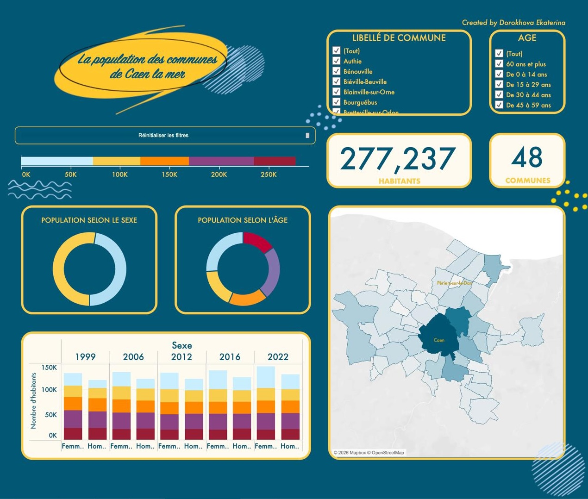
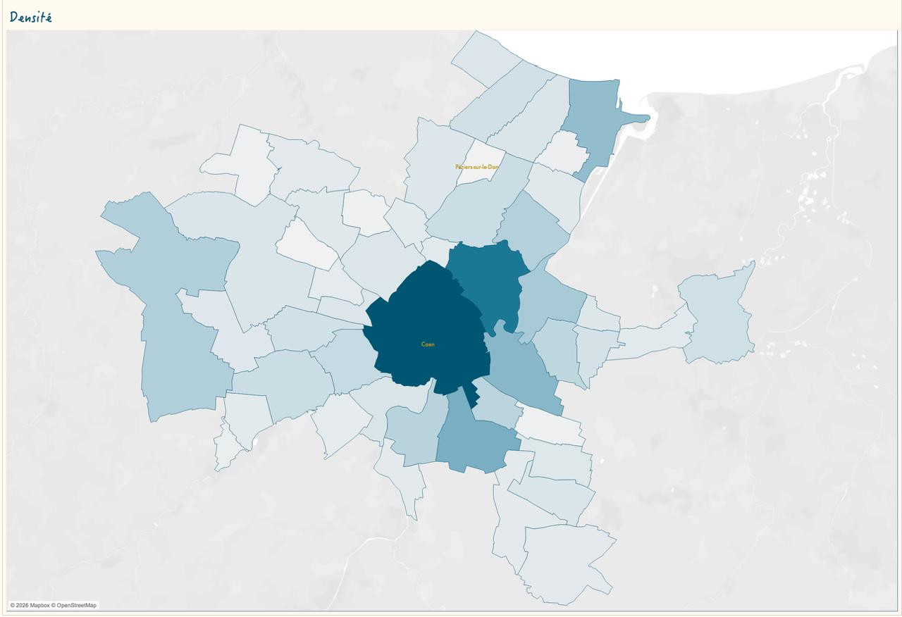
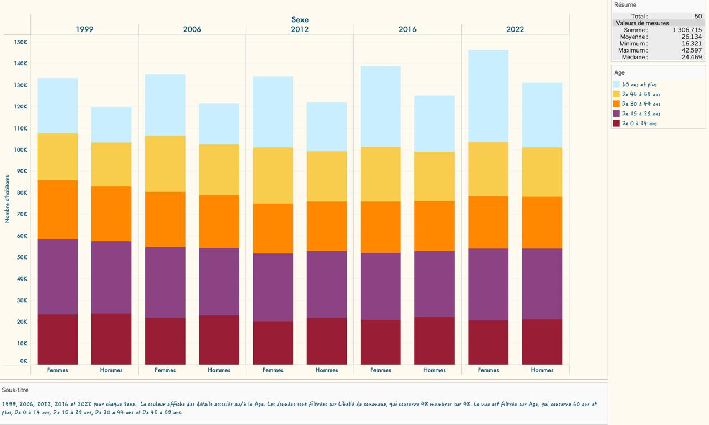
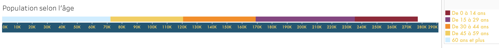

# 📍 Population Analysis — Caen-la-Mer Agglomeration

## About the Project
This project explores demographic and socioeconomic indicators 
across the communes of the Caen-la-Mer agglomeration (Normandy, France), 
using spatial and statistical data visualization. 
👉 [View Interactive Dashboard](https://public.tableau.com/views/populCaenlamerv2/Tableaudebord2?:language=en-US&:sid=&:redirect=auth&:display_count=n&:origin=viz_share_link)]

## 📊 Key Indicators Analyzed
- Population density by commune
- Share of people with higher education diplomas
- Distribution of population by age, sex, commune, education level
- Evolution of population distribution

## 🗺 Viz

## 🛠 Tools & Technologies
- **Tableau** — interactive data visualization
- **QGIS** — geospatial mapping
- **Data source:** INSEE (French National Institute 
  of Statistics and Economic Studies)

## 🎯 Goals
To identify spatial patterns in demographic and economic 
inequality across the Caen-la-Mer territory, 
with a focus on gender and age indicators.

## 👩‍💻 Author
Ekaterina Dorokhova — Master's student in Sustainable Development
